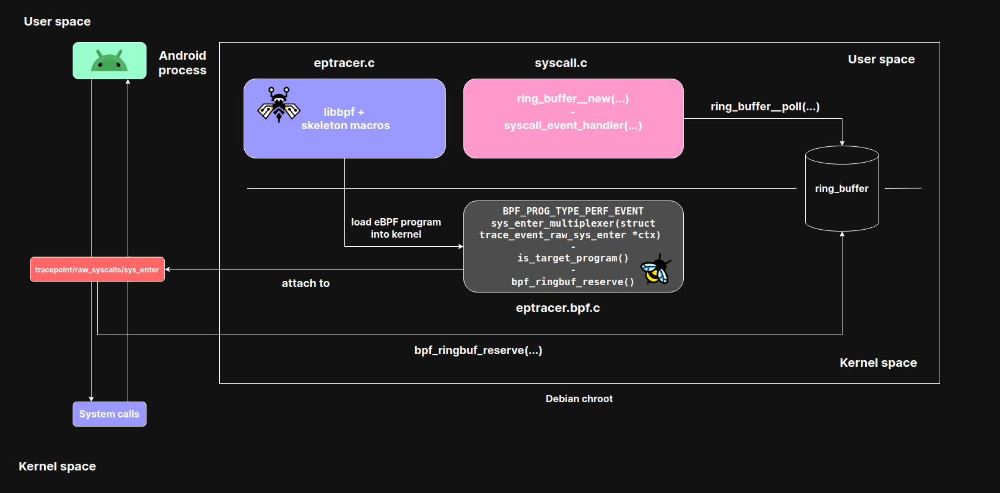
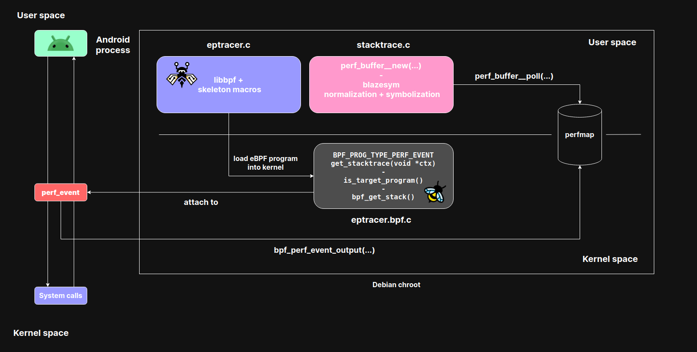

# ePtracer

eBPF-based process analyzer for Linux and Android. It can:

- trace the system calls a process makes (with decoded arguments)
- sample and dump the process call stack (user + kernel frames, symbolized)

## Architecture

ePtracer is split in a kernel side (eBPF) and a userspace side, talking through BPF maps.

**Syscall tracing** — `eptracer.bpf.c` attaches to the `tracepoint/raw_syscalls/sys_enter` tracepoint, filters events for the target process and pushes them to a ring buffer, polled and decoded by `tracers/syscall.c`:



**Backtrace analysis** — a `perf_event` program samples the target process, captures its stack with `bpf_get_stack()` and pushes it to a perf buffer, polled by `tracers/stacktrace.c` which symbolizes the frames via blazesym:



- `src/eptracer.bpf.c` — eBPF programs and maps. Filters events by target PID/program name (via `program_map`).
- `src/eptracer.c` — userspace entry point: parses arguments, loads the auto-generated skeleton (`eptracer.skel.h`), attaches programs, polls events.
- `src/tracers/` — event consumers: syscall decoding and stack trace symbolization.
- `vmlinux/<arch>/vmlinux.h` — pre-generated kernel type headers (CO-RE), so no kernel headers are needed at build time.

Vendored dependencies (git submodules): **bpftool** (skeleton generation, also provides **libbpf**), **blazesym** (Rust library for symbolization), **argparse**, **log.c**.

## Requirements

- Linux kernel with BTF enabled (`/sys/kernel/btf/vmlinux` must exist)
- `clang`/`llvm`, `make`, `libelf`
- Rust toolchain (`cargo`) for blazesym
- root privileges to run

On Debian/Ubuntu, install the build dependencies with:

```sh
./install_deps.sh          # apt packages (clang, llvm, libelf, ...)
curl https://sh.rustup.rs -sSf | sh   # Rust, if not installed
```

## Build

```sh
git clone https://github.com/faccimatteo/ePtracer.git && cd ePtracer
./build.sh
```

`build.sh` installs the missing toolchains (apt packages via `install_deps.sh`, Rust via rustup), fetches the submodules and runs `make`. If you already have the toolchains, the manual equivalent is:

```sh
git submodule update --init
make
```

`make` builds libbpf and bpftool from the submodules, compiles blazesym with cargo, compiles `eptracer.bpf.c` with `clang -target bpf`, generates the skeleton with bpftool, and links the final `eptracer` binary in the repo root.

## Usage

```
Usage: eptracer [options]

              /$$                                                             
             | $$                                                             
  /00000   /$$$$$$$$    /$$$$$$   /$$$$$$    /$$$$$$   /$$$$$$    /$$$$$$     
 /00__  00 |_  $$_/    /$$__  $$ |____  $$  /$$____/  /$$__  $$  /$$__  $$    
| 00  \ 00   | $$     | $$  \__/  /$$$$$$$ | $$      | $$$$$$$$ | $$  \__/ 
| 00  | 00   | $$ /$$ | $$       /$$__  $$ | $$      | $$_____/ | $$          
| 0000000/   |  $$$$/ | $$      |  $$$$$$$ |  $$$$$$ |  $$$$$$$ | $$          
| 10____/     \___/   |__/       \_______/  \______/  \_______/ |__/      
| 10                                                                          
| 00                                                  - by umadbro            
| 10                                                                          
|__/ 

ePtracer is a process analyzer which is capable of:
- tracing process system calls
- dumping a process backtrace to get a full overview of its call stack flow

    -h, --help                show this help message and exit
    -f, --log-file=<str>      log to FILE instead of stdout
    -p, --program=<str>       program to spawn and trace
    -P, --pid=<str>           PID to attach to
    -s, --show-stacktrace     trace process stack frames
    -S, --show-syscall        trace process syscalls
    -v, --verbose             verbose debug output
```

## Android (eadb sandbox)

Android has no native build toolchain, so ePtracer is built **on the device** inside [eadb](https://github.com/tiann/eadb), a Debian arm64 chroot managed over adb. This gives a full Linux userland (apt, clang, make) while running against the real Android kernel.

Requirements: a **rooted** device with a BTF-enabled kernel (Android 12+ / kernel 5.10+ typically qualifies).

```sh
# on the host
eadb prepare               # pushes the Debian rootfs to the device
eadb shell                 # enters the chroot as root

# inside the eadb shell
git clone <repo-url> && cd eptracer
./build.sh                 # installs build deps + Rust, then compiles
./eptracer -P <pid> -S
```

Note: the chroot lacks Android-specific kernel headers, so binder ioctl constants are hardcoded in `eptracer.bpf.c`.
